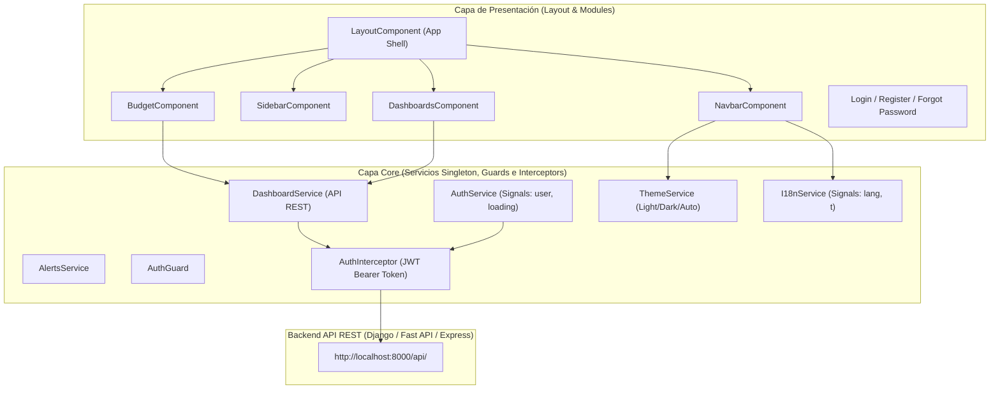

# Arquitectura del Sistema - GTOPagos

Este documento describe la arquitectura técnica, las capas de la aplicación, el patrón de diseño, el flujo de datos y la integración del sistema **GTOPagos**.

---

## 🏗️ Visión General de la Arquitectura

**GTOPagos** utiliza la arquitectura **Standalone Component** de Angular 21, eliminando la necesidad de módulos tradicionales `@NgModule` y promoviendo una estructura más limpia, desacoplada y eficiente basada en árboles de dependencias directos.

El proyecto está diseñado bajo una **Arquitectura en Capas Modular**:

---

## 🧩 Desglose por Capas

### 1. Capa Core (`src/app/core/`)
Contiene elementos singleton cargados globalmente a nivel de raíz (`providedIn: 'root'`) que gestionan la lógica transversal de la aplicación:

- **Servicios de Estado y Negocio**:
  - `AuthService`: Controla el estado del usuario autenticado (`AuthUser`), valida tokens JWT con `/token/validate/`, y almacena las credenciales en `localStorage`.
  - `DashboardService`: Agrupa todas las peticiones a los endpoints REST de tableros (`/dashboards/`), resumen actual (`/dashboard/current/`), categorías (`/finance-categories/`), movimientos (`/financial-records/`) y estados de pago (`/payment-statuses/`).
  - `ThemeService`: Controla el tema de interfaz (Claro, Oscuro o Automático del sistema) inyectando la clase `.dark` al elemento raíz `<html>`.
  - `I18nService`: Gestiona la internacionalización (Español/Inglés) con Angular Signals (`signal<Lang>`) y traducciones computadas (`computed()`).
  - `AlertsService`: Emite alertas toast flotantes consumidas por el componente visual de alertas.
- **Seguridad e Intercepción HTTP**:
  - `AuthInterceptor`: Intercepta cada solicitud HTTP saliente e inyecta el token Bearer en el encabezado `Authorization: Bearer <token>`.
  - `AuthGuard`: Guardián de rutas (`canActivate`) que verifica si el usuario está autenticado (`isAuthenticated()`) antes de dar acceso a las vistas protegidas del layout.

### 2. Capa de Layout (`src/app/layout/`)
Define el **App Shell** principal de la aplicación:
- `LayoutComponent`: Actúa como contenedor envolvente para todas las pantallas privadas. Integra la barra de navegación superior (`NavbarComponent`), el menú lateral (`SidebarComponent`) y el área de contenido principal (`<router-outlet>`).
- `layout.routes.ts`: Configura el enrutamiento protegido mediante `canActivate: [AuthGuard]`.

### 3. Capa de Módulos / Vistas (`src/app/modules/`)
Organiza las características o pantallas de la aplicación en módulos funcionales independientes:

- **`auth/`**: Flujo de autenticación (Login, Registro).
- **`budget/`**: 
  - `dashboards/pages/dashboards.component.ts`: Vista principal de tableros. Permite crear, actualizar y eliminar tableros (`EXPENSES`, `INCOME`, `BOTH`), además de importar transacciones masivas desde Excel (`XLSX`).
  - `budget.component.ts`: Vista detallada de un tablero específico. Presenta métricas acumuladas (Ingresos, Gastos, Balance), tablas divididas por tipo de movimiento, selector de compras a crédito/cuotas y modales para CRUD de movimientos.
- **`configuration/`**: Panel de ajustes para cambiar tema, idioma y perfil de usuario.
- **`dashboard/`**: Panel de resumen ejecutivo general.
- **`forgot-password/`**: Formulario de solicitud de recuperación de contraseña.

### 4. Capa Compartida (`src/app/shared/`)
Reúne código y componentes reutilizables:
- `shared.config.ts`: Exporta la constante `SHARED_IMPORTS` con todos los módulos comunes (CommonModule, ReactiveFormsModule, FormsModule, LucideIconModule, RouterLink, etc.) para simplificar las declaraciones de componentes Standalone.
- `ui/`: Componentes compartidos de interfaz (`navbar`, `sidebar`, `alerts`).

---

## ⚡ Gestión del Estado y Reactividad

GTOPagos combina dos tecnologías reactivas complementarias:

1. **Angular Signals (`signal()`, `computed()`)**:
   - Utilizado para estados locales y síncronos globales de respuesta inmediata.
   - Ejemplos: `AuthService.user` (`signal<AuthUser | null>`), `I18nService._lang` (`signal<Lang>`), y la propiedad calculada `I18nService.t` (`computed()`).
2. **RxJS (`Observable`, `Subject`, `pipe`, `tap`, `finalize`)**:
   - Utilizado para flujos asíncronos y operaciones de red con `HttpClient`.
   - Permite combinar peticiones simultáneas en la importación masiva de Excel mediante `forkJoin`.

---

## 🔐 Autenticación y Flujo de Sesión

1. El usuario ingresa sus credenciales en `LoginComponent`.
2. `AuthService` guarda los tokens `access_token` y `refresh_token` en el `localStorage` del navegador.
3. El `AuthInterceptor` adjunta el encabezado `Authorization: Bearer <access_token>` en todas las solicitudes posteriores a la API.
4. El `AuthGuard` restringe la navegación hacia cualquier ruta del `layout` si no existe un token válido en sesión.
