# Arquitectura del Sistema - GTOPagos

Este documento describe la arquitectura técnica, las capas de la aplicación, el patrón de diseño, el flujo de datos y la integración del sistema **GTOPagos**.

---

## 🏗️ Visión General de la Arquitectura

**GTOPagos** utiliza la arquitectura **Standalone Component** de Angular 21, eliminando la necesidad de módulos tradicionales `@NgModule` y promoviendo una estructura más limpia, desacoplada y eficiente basada en árboles de dependencias directos.

El proyecto está diseñado bajo una **Arquitectura en Capas Modular**:

```mermaid
flowchart TD
    subgraph UI_Layer ["Capa de Presentación (Layout, Modules & Atomic UI)"]
        LayoutComponent["LayoutComponent (App Shell)"]
        NavbarComponent["NavbarComponent"]
        SidebarComponent["SidebarComponent"]
        BudgetComp["BudgetComponent"]
        DashboardsComp["DashboardsComponent"]
        GoalsComp["GoalsComponent"]
        ReportsComp["ReportsComponent"]
        ConfigComp["ConfigurationComponent"]
        AuthComp["Login / Register / Forgot / Demo"]
        TourComp["TourComponent (Spotlight Overlay)"]

        subgraph Atomic_UI ["Componentes Compartidos (Atomic Design)"]
            Atoms["Átomos (Buttons, Badges, Inputs, Modals, Spinners)"]
            Molecules["Moléculas (StatCards, BalanceCards, AdviceCards, Navs)"]
            Organisms["Organismos (RecordsTable, ImportModal, GoalCards, ReportTables)"]
        end
    end

    subgraph Core_Layer ["Capa Core (Servicios Singleton, Guards e Interceptors)"]
        AuthService["AuthService (Signals: user, loading)"]
        DashboardService["DashboardService (API REST)"]
        GoalService["GoalService (Metas de ahorro)"]
        ReportService["ReportService (Reportes, PDF, Excel)"]
        TourService["TourService (Signals: activeStep, isTourActive)"]
        ThemeService["ThemeService (Light/Dark/Auto)"]
        I18nService["I18nService (Signals: lang, t)"]
        AlertsService["AlertsService"]
        AuthGuard["AuthGuard"]
        AuthInterceptor["AuthInterceptor (JWT Bearer Token)"]
        ErrorInterceptor["ErrorInterceptor (Captura global de errores HTTP)"]
    end

    subgraph Backend_API ["Backend API REST (Django / DRF)"]
        API_Endpoints["http://localhost:8000/api/"]
    end

    LayoutComponent --> SidebarComponent
    LayoutComponent --> NavbarComponent
    LayoutComponent --> BudgetComp
    LayoutComponent --> DashboardsComp
    LayoutComponent --> GoalsComp
    LayoutComponent --> ReportsComp
    LayoutComponent --> ConfigComp
    LayoutComponent --> TourComp

    BudgetComp --> Organisms
    DashboardsComp --> Organisms
    GoalsComp --> Organisms
    ReportsComp --> Organisms
    Organisms --> Molecules
    Molecules --> Atoms

    BudgetComp --> DashboardService
    DashboardsComp --> DashboardService
    GoalsComp --> GoalService
    ReportsComp --> ReportService
    TourComp --> TourService
    ConfigComp --> AuthService

    NavbarComponent --> ThemeService
    NavbarComponent --> I18nService

    DashboardService --> AuthInterceptor
    GoalService --> AuthInterceptor
    ReportService --> AuthInterceptor
    AuthService --> AuthInterceptor
    AuthInterceptor --> ErrorInterceptor
    ErrorInterceptor --> API_Endpoints
```

---

## 🧩 Desglose por Capas

### 1. Capa Core (`src/app/core/`)
Contiene elementos singleton cargados globalmente a nivel de raíz (`providedIn: 'root'`) que gestionan la lógica transversal de la aplicación:

- **Servicios de Estado y Negocio**:
  - `AuthService`: Controla el estado del usuario autenticado (`AuthUser`), valida tokens JWT con `/token/validate/`, gestiona login estándar y demo (`/demo-login/`), y almacena credenciales en `localStorage`.
  - `DashboardService`: Agrupa las peticiones REST para tableros (`/dashboards/`), resumen actual (`/dashboard/current/`), categorías (`/finance-categories/`), movimientos (`/financial-records/`), transacciones recientes y estados de pago.
  - `GoalService`: Administra el ciclo de vida de metas de ahorro financiero (`/goals/`), cálculo de progreso porcentual y vinculación de abonos.
  - `ReportService`: Provee datos analíticos consolidados (`/reports/data/`) y descarga de exportables formateados en **PDF** y **Excel** (`/reports/download/`).
  - `TourService`: Orquesta los tutoriales guiados interactivos para cada módulo mediante Signals (`isTourActive`, `currentStep`), calculando posiciones geométricas para el spotlight y guardando el historial de visualización en `localStorage`.
  - `ThemeService`: Controla el tema de interfaz (Claro, Oscuro o Automático) inyectando o removiendo la clase `.dark` en la etiqueta raíz `<html>`.
  - `I18nService`: Gestiona la internacionalización (Español e Inglés) con Angular Signals (`signal<Lang>`) y traducciones computadas (`computed()`).
  - `AlertsService`: Emite alertas toast flotantes temporizadas (éxito, error, advertencia e información).
- **Seguridad e Intercepción HTTP**:
  - `AuthInterceptor`: Intercepta cada solicitud saliente e inyecta el token de autenticación en la cabecera `Authorization: Bearer <token>`.
  - `ErrorInterceptor`: Captura globalmente errores HTTP (401 no autorizado, 403 prohibido, 500 error de servidor), coordinando el cierre de sesión si el token expira y disparando notificaciones visuales automáticas con `AlertsService`.
  - `AuthGuard`: Guardián de rutas funcionales (`canActivate`) que protege las vistas privadas contra accesos sin token válido.

### 2. Capa de Layout (`src/app/layout/`)
Define el **App Shell** principal de la aplicación:
- `LayoutComponent`: Envoltorio estructural de todas las rutas protegidas. Integra la barra superior (`NavbarComponent`), la barra de navegación lateral colapsable (`SidebarComponent`), el contenedor de overlay para tours interactivos (`TourComponent`) y el área de renderizado de vistas (`<router-outlet>`).
- `layout.routes.ts`: Declara las rutas hijas protegidas (`dashboard`, `budget`, `goals`, `reports`, `configuration`) bajo la custodia de `AuthGuard`.

### 3. Capa de Módulos / Vistas (`src/app/modules/`)
Organiza las pantallas de la aplicación en módulos funcionales desacoplados:

- **`auth/`**:
  - `login.component.ts`, `register.component.ts`: Flujos estándar de credenciales.
  - `demo.component.ts`: Punto de entrada directo al **Modo Demo** sin contraseña para exploradores y portafolios.
- **`budget/`**:
  - `dashboards/`: Tableros financieros generales (`EXPENSES`, `INCOME`, `BOTH`), importador inteligente de Excel (`.xlsx`) y tarjetas de asesoría financiera (`AdviceCardsComponent`).
  - `budget.component.ts`: Vista detallada de presupuesto con métricas clave ("Total a pagar", "Pendiente de pago", "Gastos pagados", "Balance total"), tablas segmentadas por tipo de transacción, seguimiento de compras a cuotas/crédito y modales interactivos.
- **`goals/`**: Gestión completa de metas financieras de ahorro con barra de progreso, fechas estimadas y abonos acumulados.
- **`reports/`**: Vista analítica avanzada con filtros por rango de fechas, distribución de gastos por categoría, comparativas de períodos y exportación directa a PDF y Excel.
- **`configuration/`**: Panel de ajustes estructurado en pestañas dedicadas: Perfil de usuario, Preferencias de notificaciones (alertas de presupuesto, recordatorios de pago y metas), Apariencia visual (modo oscuro/claro) e Idioma.
- **`forgot-password/`**: Solicitud de restablecimiento de contraseña.

### 4. Capa Compartida y Atomic Design (`src/app/shared/`)
Estructura la interfaz visual en un sistema de diseño atómico reutilizable:
- **Átomos (`ui/atoms/`)**: Componentes base de mínima complejidad visual: `button`, `badge`, `input`, `select`, `icon`, `spinner`, `toast`, `kpi-card`, `modal`.
- **Moléculas (`ui/molecules/`)**: Composiciones funcionales de átomos: `stat-card`, `balance-card`, `chart-card`, `dashboard-card`, `advice-cards`, `progress-bar`, `search-bar`, `tabs-nav`, `empty-state`, `pagination`.
- **Organismos (`ui/organisms/`)**: Componentes de vista complejos con lógica de presentación: `financial-records-table`, `budget-overview`, `category-progress-list`, `record-form-modal`, `import-preview-modal`, `goal-card`, `report-table`.
- **Tour Guiado (`ui/tour/`)**: `TourComponent` que crea el efecto de foco visual (spotlight) y sitúa las tarjetas de ayuda contextual de manera dinámica sobre cualquier elemento del DOM.
- `shared.config.ts`: Exporta `SHARED_IMPORTS` para estandarizar las dependencias de todos los componentes Standalone.

---

## ⚡ Gestión del Estado y Reactividad

GTOPagos combina dos tecnologías reactivas complementarias:

1. **Angular Signals (`signal()`, `computed()`)**:
   - Utilizado para estados síncronos, valores computados y reactividad de alta fidelidad en componentes y servicios globales.
   - Ejemplos: `AuthService.user` (`signal<AuthUser | null>`), `TourService.isTourActive` (`signal<boolean>`), `I18nService.t` (`computed()`).
2. **RxJS (`Observable`, `Subject`, `pipe`, `tap`, `finalize`, `forkJoin`)**:
   - Utilizado para flujos asíncronos y operaciones de red con `HttpClient`.
   - Permite combinar peticiones concurrentes en la importación masiva de Excel y el procesamiento secuencial con interceptores.

---

## 🔐 Autenticación, Sesión y Modo Demo

1. **Autenticación Estándar**:
   - El usuario ingresa credenciales en `LoginComponent`.
   - `AuthService` guarda los tokens `access_token` y `refresh_token` en `localStorage`.
   - `AuthInterceptor` adjunta el encabezado `Authorization: Bearer <access_token>` en todas las peticiones posteriores.
   - `AuthGuard` bloquea accesos no autenticados y redirige hacia el login.
2. **Modo Demo (Invitados)**:
   - Al hacer clic en "Probar Modo Demo" o navegar a `/demo`, la aplicación contacta al endpoint `POST /api/demo-login/`.
   - El backend genera o reinicia un entorno de usuario demo con datos precargados realistas (tableros, movimientos recurrentes, cuotas, metas de ahorro y categorías).
   - Se devuelven tokens JWT válidos que otorgan una sesión completa e interactiva sin alterar datos de usuarios reales.

