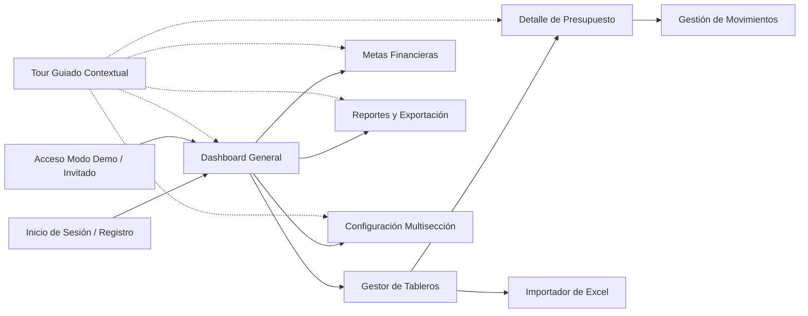

# Documento de Requerimientos de Producto (PRD) - GTOPagos

Este documento especifica los requerimientos de producto, la visión, la propuesta de valor, las historias de usuario y la funcionalidad del sistema **GTOPagos**.

---

## 🎯 Visión del Producto

**GTOPagos** es una plataforma de software diseñada para transformar la manera en que las personas y pequeñas empresas gestionan sus finanzas personales y operativas. Su propósito es brindar claridad absoluta sobre el flujo de caja, el estado de las compras a crédito, los compromisos de pago recurrentes y el cumplimiento de presupuestos, todo dentro de una interfaz moderna, fluida e intuitiva.

---

## 💎 Propuesta de Valor

- **Control Centralizado de Finanzas**: Administración unificada de ingresos y gastos divididos por tableros temáticos (p. ej. "Hogar", "Negocio", "Proyectos Especiales").
- **Gestión Inteligente de Crédito y Cuotas**: Distinción clara entre compras al contado (`DEBIT`) y compras a plazos (`CREDIT`) con seguimiento del número de parcialidades pagadas y pendientes.
- **Automatización mediante Importación de Excel**: Eliminación del registro manual tedioso mediante un analizador inteligente de archivos `.xlsx` que detecta y clasifica los movimientos bancarios.
- **Experiencia Adaptable e Inclusiva**: Soporte completo para Modo Oscuro y cambio dinámico de idioma (Español / Inglés).

---

## 👤 Audiencia Objetiva

1. **Usuarios Particulares**: Personas que buscan organizar sus finanzas del hogar, rastrear tarjetas de crédito y evitar atrasos en pagos.
2. **Freelancers y Emprendedores**: Profesionales independientes que requieren separar sus presupuestos de operación de sus finanzas personales.
3. **Equipos Pequeños**: Organizaciones que gestionan fondos por proyecto y requieren llevar un control visual de presupuestos asignados.

---

## 📋 Módulos Funcionales y Flujos de Usuario

### 1. Módulo de Autenticación, Seguridad y Modo Demo
- **Inicio de Sesión Estándar**: Validación de credenciales email/contraseña y recepción de token JWT.
- **Modo Demo / Invitado**: Acceso directo con un solo clic a un entorno completamente funcional con datos de ejemplo interactivos, ideal para evaluación de portafolio y pruebas de concepto sin registro previo.
- **Registro de Usuarios**: Creación de nueva cuenta con validación de fortaleza de credenciales.
- **Recuperación de Contraseña**: Solicitud de restablecimiento vía correo electrónico con token seguro.

### 2. Módulo de Tableros / Presupuestos (`DashboardsComponent`)
- **Gestión de Tableros**: Creación y edición con tipo de tablero (`Solo gastos`, `Solo ingresos`, `Ambos`), descripción y balances acumulados.
- **Tarjetas de Resumen**: Vista rápida del balance global, total de ingresos, total de gastos y número de movimientos registrados.
- **Tarjetas de Consejos Financieros (`AdviceCards`)**: Recomendaciones contextuales sobre salud financiera y control presupuestal.

### 3. Módulo de Detalle de Presupuesto (`BudgetComponent`)
- **Indicadores Clave Estandarizados (KPIs)**:
  - **Total de ingresos**: Suma total devengada del período.
  - **Total a pagar**: Suma consolidada de compromisos y gastos del corte actual.
  - **Pendiente de pago**: Montos pendientes por liquidar.
  - **Gastos pagados**: Obligaciones ya cubiertas.
  - **Balance neto disponible**: Diferencia entre ingresos y gastos totales.
- **Navegación por Pestañas**: Segmentación instantánea entre *Gastos* e *Ingresos*.
- **Distribución por Categorías**: Visualización de avance y porcentaje de consumo presupuestal por categoría.
- **Tabla Paginada de Movimientos**: CRUD completo con soporte de compras al contado (`DEBIT`) o crédito (`CREDIT`) a cuotas/parcialidades y gastos recurrentes.

### 4. Módulo de Metas Financieras (`GoalsComponent`)
- **Establecimiento de Objetivos**: Registro de metas con monto objetivo, monto acumulado y fecha estimada de finalización.
- **Visualización de Progreso**: Indicadores porcentuales, barras de progreso y cálculo dinámico del tiempo y aportes restantes.
- **Vinculación de Movimientos**: Asociación de registros financieros a metas específicas para trazabilidad de ahorro.

### 5. Módulo de Reportes y Analítica (`ReportsComponent`)
- **Consolidación Financiera**: Métricas analíticas con filtros por rango de fechas (mensual, trimestral, anual).
- **Desglose de Gastos**: Visualización por categorías, tasas de ahorro y proyecciones financieras.
- **Exportación Multi-formato**: Descarga instantánea de reportes en documentos ejecutivos **PDF** y hojas de cálculo **Excel** (`.xlsx`).

### 6. Módulo de Configuración (`ConfigurationComponent`)
- **Estructura por Pestañas**:
  - **Perfil**: Datos personales, teléfono de contacto y salarios de referencia.
  - **Notificaciones**: Preferencias de alertas de presupuesto, recordatorios de pago, avisos de metas y reportes periódicos.
  - **Apariencia**: Conmutador dinámico de Tema Claro (Light), Tema Oscuro (Dark) y Detección Automática del Sistema Operativo.
  - **Idioma**: Selección instantánea entre Español (`es`) e Inglés (`en`).

### 7. Sistema de Tours Guiados Interactivos
- **Acompañamiento en Pantalla**: Asistente visual con foco interactivo (spotlight), oscurecimiento periférico y tooltips explicativos paso a paso para acelerar la curva de aprendizaje en cada sección del sistema.

---

## 🎨 Requerimientos No Funcionales

- **Rendimiento**: Tiempo de renderizado inicial $\le 100\text{ ms}$ en operaciones locales y transiciones de Signals.
- **Accesibilidad y Legibilidad**: Contraste calibrado según directivas WCAG 2.1 tanto en modo claro como en modo oscuro.
- **Diseño Responsivo**: Adaptabilidad completa para resoluciones móviles, tablets, laptops y pantallas ultrawide.
- **Soporte Offline & PWA**: Capacidad de instalación como Progressive Web App y almacenamiento en caché de activos estáticos.

