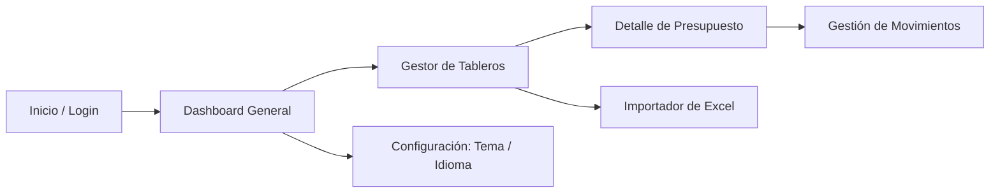

# Documento de Requerimientos de Producto (PRD) - GTOPagos

Este documento especifica los requerimientos de producto, la visión, la propuesta de valor, las historias de usuario y la funcionalidad del sistema **GTOPagos**.

---

## 🎯 Visión del Producto

**GTOPagos** es una plataforma de software diseñada para transformar la manera en que las personas y pequeñas empresas gestionan sus finanzas personales y operativas. Su propósito es brindar claridad absoluta sobre el flujo de caja, el estado de las compras a crédito, los compromisos de pago recurrentes y el cumplimiento de presupuestos, todo dentro de una interfaz moderna, fluida e intuitiva.

---

## 💎 Propuesta de Valor

- **Control Centralizado de Finanzas**: Administración unificada de ingresos y gastos divididos por tableros temáticos (p. ej. "Hogar", "Negocio", "Proyectos Especiales").
- **Gestión Inteligente de Crédito y Cuotas**: Distinción clara entre compras al contado (`DEBIT`) y compras a plazos (`CREDIT`) con seguimiento del número de parcialidades pagadas y pendientes.
- **Automatización mediante Importación de Excel**: Eliminación del registro manual tedioso mediante un analizador inteligente de archivos `.xlsx` que detecta y clasifica los movimientos bancarios.
- **Experiencia Adaptable e Inclusiva**: Soporte completo para Modo Oscuro y cambio dinámico de idioma (Español / Inglés).

---

## 👤 Audiencia Objetiva

1. **Usuarios Particulares**: Personas que buscan organizar sus finanzas del hogar, rastrear tarjetas de crédito y evitar atrasos en pagos.
2. **Freelancers y Emprendedores**: Profesionales independientes que requieren separar sus presupuestos de operación de sus finanzas personales.
3. **Equipos Pequeños**: Organizaciones que gestionan fondos por proyecto y requieren llevar un control visual de presupuestos asignados.

---

## 📋 Módulos Funcionales y Flujos de Usuario

### 1. Módulo de Autenticación y Seguridad
- **Inicio de Sesión**: Validación de credenciales email/password y recepción de token JWT.
- **Registro de Usuarios**: Creación de nueva cuenta de usuario en el sistema.
- **Recuperación de Contraseña**: Flujo de solicitud de restablecimiento para usuarios que olvidaron su clave.
- **Persistencia de Sesión**: Mantener sesión activa mediante tokens almacenados de forma segura.

### 2. Módulo de Tableros / Presupuestos (`DashboardsComponent`)
- **Creación de Tableros**: Definición de nombre, descripción y tipo de tablero (`Solo gastos`, `Solo ingresos`, `Ambos`).
- **Vista de Tarjetas**: Visualización rápida del balance total, ingresos agregados, gastos agregados y recuento de registros.
- **Edición y Eliminación**: Modificación de datos del tablero y eliminación confirmada mediante modales interactivos.

### 3. Módulo de Detalle de Presupuesto (`BudgetComponent`)
- **Navegación por Pestañas**: Alternancia entre vistas de *Gastos* e *Ingresos*.
- **Indicadores Clave (KPIs)**:
  - Total de Ingresos del período.
  - Total de Gastos del período.
  - Balance neto disponible.
- **Resumen por Categorías**: Barras de progreso visuales con porcentaje de cumplimiento y presupuesto consumido por categoría.
- **Sección de Pagos Pendientes**: Lista rápida de transacciones pendientes por saldar.
- **Tabla Paginada de Movimientos**:
  - Creación de nuevo movimiento con selección de monto, descripción, fecha, categoría, tipo de pago (Contado/Crédito) y cantidad de cuotas.
  - Edición y eliminación de registros existentes.
  - Paginación interactiva.

### 4. Módulo de Importación Inteligente desde Excel
- **Carga de Archivos**: Arrastrar o seleccionar un archivo de hoja de cálculo `.xlsx`.
- **Análisis Automatizado**: Identificación de nombres de columnas, montos, cálculo de total acumulado y frecuencias.
- **Sugerencia de Tipo**: Clasificación automática entre pago único, cuotas/parcialidades o gasto recurrente.
- **Vista Previa y Mapeo**: Confirmación del usuario antes de guardar masivamente las transacciones en los tableros elegidos.

### 5. Módulo de Configuración y Personalización (`ConfigurationComponent`)
- **Selector de Tema**: Alternar entre Modo Claro (Light), Modo Oscuro (Dark) y Ajuste Automático por Sistema Operativo.
- **Selector de Idioma**: Cambiar instantáneamente entre Español e Inglés en toda la interfaz sin necesidad de recargar la página.

---

## 🎨 Requerimientos No Funcionales

- **Rendimiento**: Tiempo de respuesta de interfaz $\le 100\text{ ms}$ en interacciones locales.
- **Accesibilidad y Legibilidad**: Contraste alto en textos y tarjetas tanto en modo claro como en modo oscuro.
- **Diseño Responsivo**: Adaptabilidad completa para pantallas de escritorio, laptops, tablets y smartphones.
